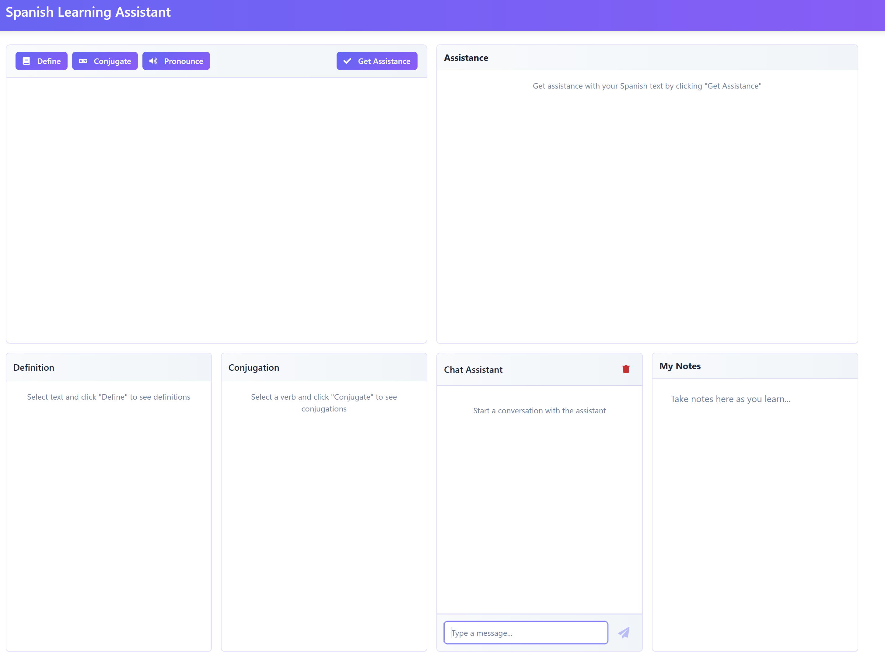

# Fluency App

This is a React-based application that combines a text editor with language learning features such as definition lookup, conjugation, and pronunciation.


*Figure 1: UI Example*

## Features

- Text editor with Define, Conjugate, and Pronounce options
- Assistance for improving language skills
- Dark mode UI with gradient aesthetics

## Future Enhancements
1. Add Password Authentication
2. Modify the `nginx.conf` to point to backend as well
3. Modify python backend code to nodejs and combine application together
4. Add more Languages
5. Update TTS API using new OpenAI API released March 2025
6. Save words to host volume and export as csv for google sheets

## Getting Started

1. Make sure you have Node.js installed on your system.
2. Navigate to the project directory in your terminal.
3. Install the dependencies by running:

   ```
   npm install
   ```

4. Set up the environment variable for the API base URL:

   Create a `.env` file in the root of the project and add the following line:

   ```
   REACT_APP_API_BASE_URL=http://your-api-base-url
   ```

   Replace `http://your-api-base-url` with the actual URL of your backend API.

5. Start the development server:

   ```
   npm start
   ```

6. Open your browser and visit `http://localhost:3000` to see the application.

## Usage

- Type or paste text in the editor.
- Select a word or phrase and use the Define, Conjugate, or Pronounce buttons to get more information.
- Use the language dropdown to switch between Spanish, French, and Portuguese.
- Click "Get Assistance" to receive suggestions for improving your text.

## Customization

You can customize the appearance by modifying the `App.css` file, and adjust the functionality by editing the components in the `src/components` directory.

## Backend API

Ensure your backend API has the following endpoints:

- POST /api/define: For definitions
- POST /api/conjugate: For conjugations
- POST /api/assist: For language assistance
- POST /pronounce: For pronunciation

Each endpoint should accept JSON with `text` and `language` fields.

# Getting Started with Create React App
To prepare your application for production and run it in Docker, follow these steps:

Build the React App:

Run the build command to create an optimized production build of your React app.
npm run build
Create a Dockerfile:

Create a Dockerfile in the root of your project to define the Docker image.
Use a multi-stage build to first build the React app and then serve it using a lightweight web server like nginx.

```yaml
# Stage 1: Build the React app
FROM node:14 as build

WORKDIR /app

COPY package.json package-lock.json ./
RUN npm install

COPY . .
RUN npm run build

# Stage 2: Serve the app with nginx
FROM nginx:alpine

COPY --from=build /app/build /usr/share/nginx/html

# Copy custom nginx configuration
# Stage 1: Build the React app
FROM node:14 as build

WORKDIR /app

COPY package.json package-lock.json ./
RUN npm install

ARG REACT_APP_API_BASE_URL
ENV REACT_APP_API_BASE_URL=$REACT_APP_API_BASE_URL

COPY . .
RUN npm run build

# Stage 2: Serve the app with nginx
FROM nginx:alpine

COPY --from=build /app/build /usr/share/nginx/html

# Copy custom nginx configuration
COPY nginx.conf /etc/nginx/conf.d/default.conf

EXPOSE 80

CMD ["nginx", "-g", "daemon off;"]
```

Build the Docker Image:

Build the Docker image using the Dockerfile.
`docker build --build-arg REACT_APP_API_BASE_URL=http://192.168.1.250:5001 -t fluent-front .`

Run the Docker Container:

Run the Docker container, mapping port 80 in the container to port 3000 on your host.
`docker run -d -p 3000:80 fluent-front`
Set Environment Variables:

Ensure that the REACT_APP_API_BASE_URL environment variable is set to `http://192.168.1.250:5000` when building the Docker image or running the container.
By following these steps, you can build and run your React app in a Docker container, serving it on 0.0.0.0:3000 and proxying API requests to the FastAPI endpoint at 192.168.1.250:5000.
